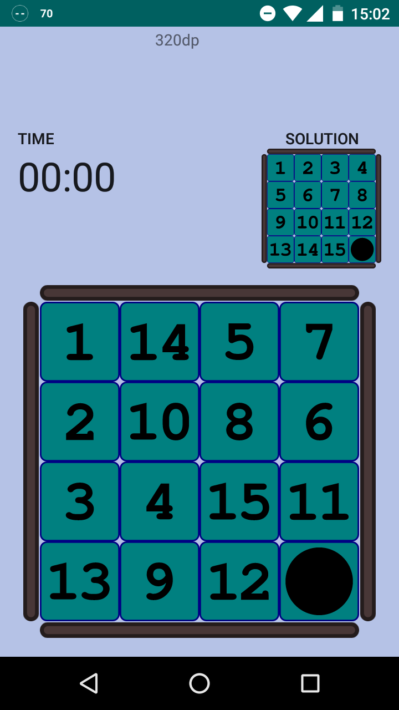
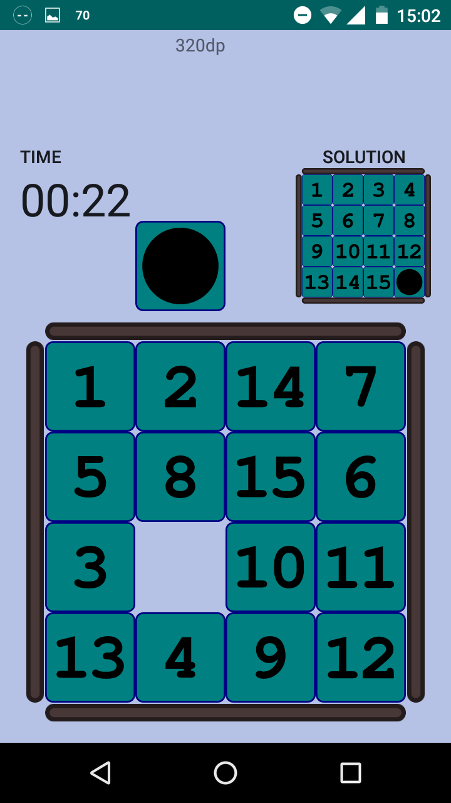
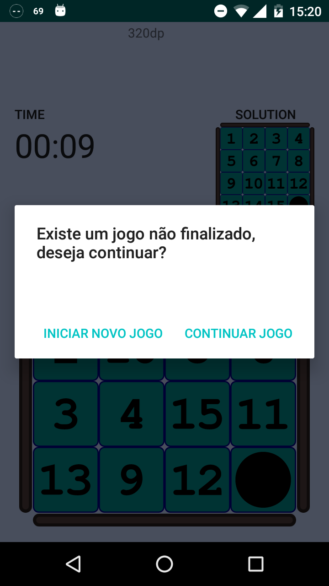
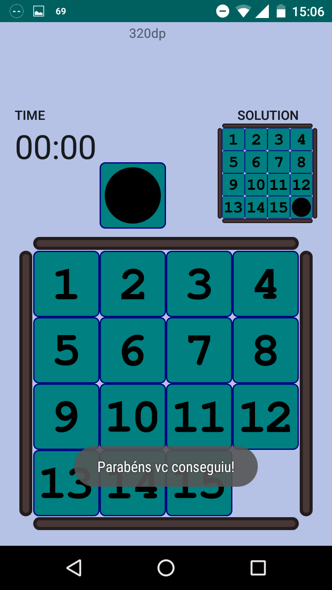

### What is this repository for? ###

* Android project developed to learn more about the Android platform. This is the classic game to organize numbers in ascending order from 1 to 15.
* Version: 1.0

### Development Tools and Technologies ###

* Java Programming Language 
* Android Studio
* Inkscape (to create Scalable Vector Graphics)

### How do I get set up? ###

* Clone repository
* Open project with Android Studio

### Screenshots ###

##### Initial Screen

 

##### Playing

 

##### Continuing a game match

 

##### Challenge Finished

